# CartMode

## Arquitecturas de Software (ARSW) 
## 2019-1 
## Escuela Colombiana de Ingeniería Julio Garavito - Ingeniería de Sistemas
#### Juego educativo, competitivo y a su vez de entretenimiento tipo seleccion de parejas que pretende poner a prueba las hablidades cognitivas de los usuarios, complementandolo con preguntas sencillas de matematicas..
---
### Integrante
- Cesar E. Lanos Camacho
### Profesor
- David Saavedra
---
### :link: URLs
| Elemento | Link |
|:-------------------------------------:|:----------------------------------------------------------------------------------------------------:|
| Propuesta de proyecto | https://docs.google.com/document/d/1ynF7FltaMq4Is_eI6oozmRWI5bi-lQrzWnHo84oVVRc/edit?usp=sharing  |
| Taiga | https://tree.taiga.io/project/cefarr-cartmode/timeline  |  
| NinjaMock | https://ninjamock.com/s/V5J5CSx  | 
| Javadoc | Generado en la ruta ./target/site/apidocs |
| Documento de Arquitectura del Sistema | https://drive.google.com/file/d/1Q7eTkRk0ZuE1sClnu6SufcEVbkiP3maU/view?usp=sharing | 
| Servidor 1 | http://35.229.25.251:8080/ | 
| Servidor 2 | http://34.74.198.173:8080/ | 
| Balanceador de Carga | http://35.211.240.94:8080/ | 
---
### :book: Instrucciones
Proximamente

---

### :camera: Pantallas de la aplicación-- Pruebas Funcionales.

### :book: Requisitos Funcionales

- El jugador inicia la aplicacion e ingresa a la pagina de bienvenida.

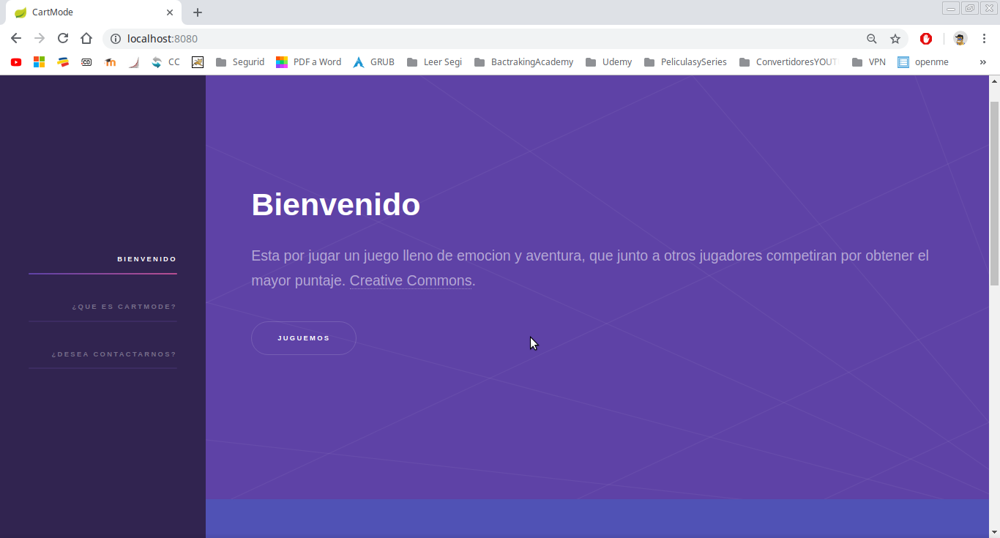

---

- El jugador se conecta y queda registrado en una sala unica.(De ser el primero queda como anfitrion).

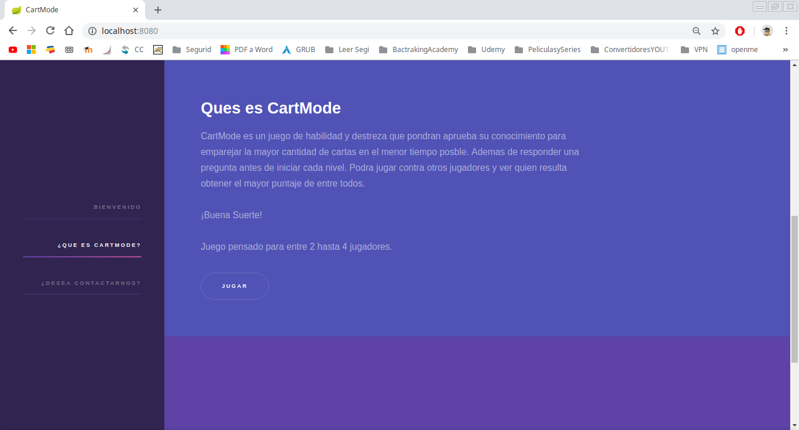

---

- Cada jugador puede conocer tanto su anfitrion como los demas participantes de su partida.

---

-Como se observa Cesar ingreso a la sala de juego.
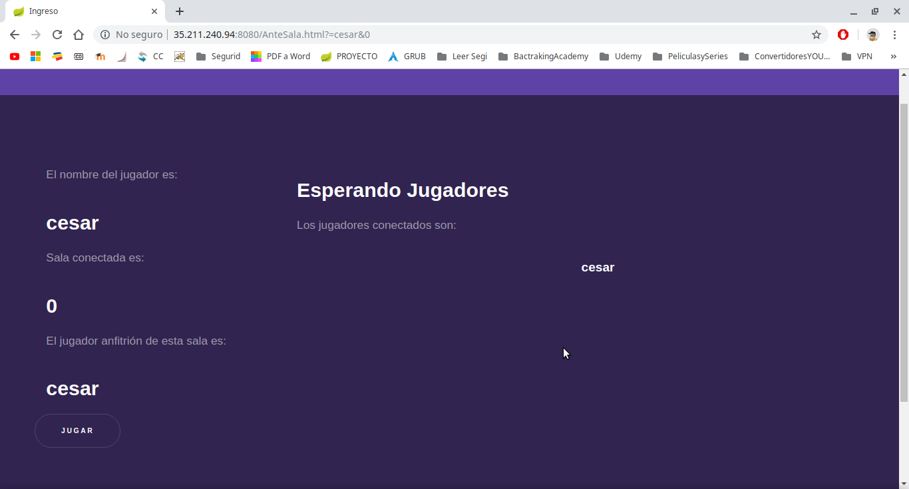

---
- El Anfitrion no puede iniciar la partida ya que no hay suficientes jugadores conectados.
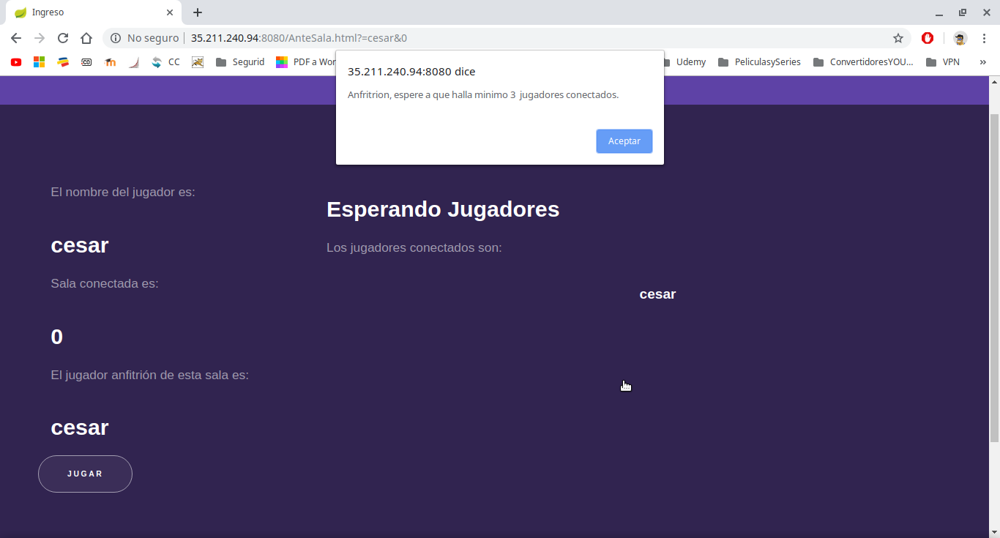

---

- Ingreso Leonado pero el jugador Anfitrion es el unico que puede iniciar la partida (Cesar).

---
-Como se observa Leonardo y Pepita han ingresado a la sala de juego.

---

-Ya se completaron los jugadores minimos, y el Anfitrion inicia la partida.
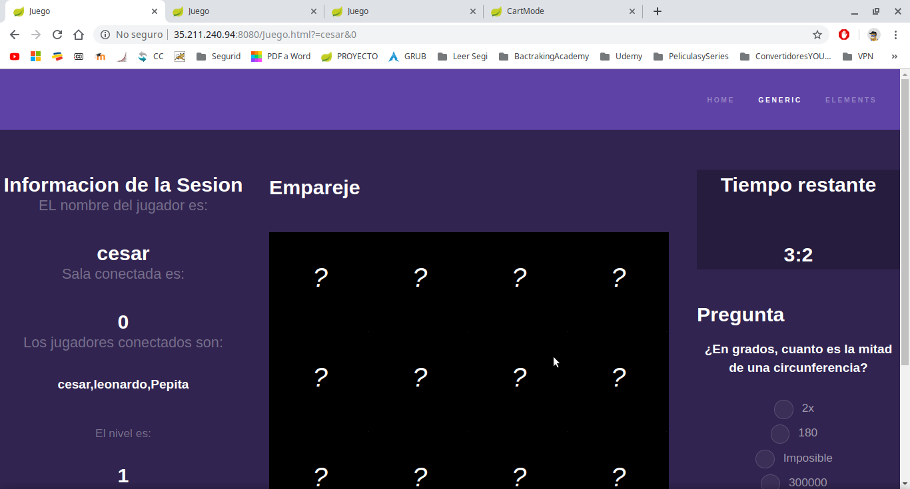

---

-Los jugadores comienzan a jugar y se evidencia el Stomp funcionando. Ademas se 
puede apreciar que cada jugador tiene su propio color caracteristico.

---

-Otro usuario se conecta pero ya no hace parte de la sala anteriormente creada, 
    es agregado a una nueva sala.

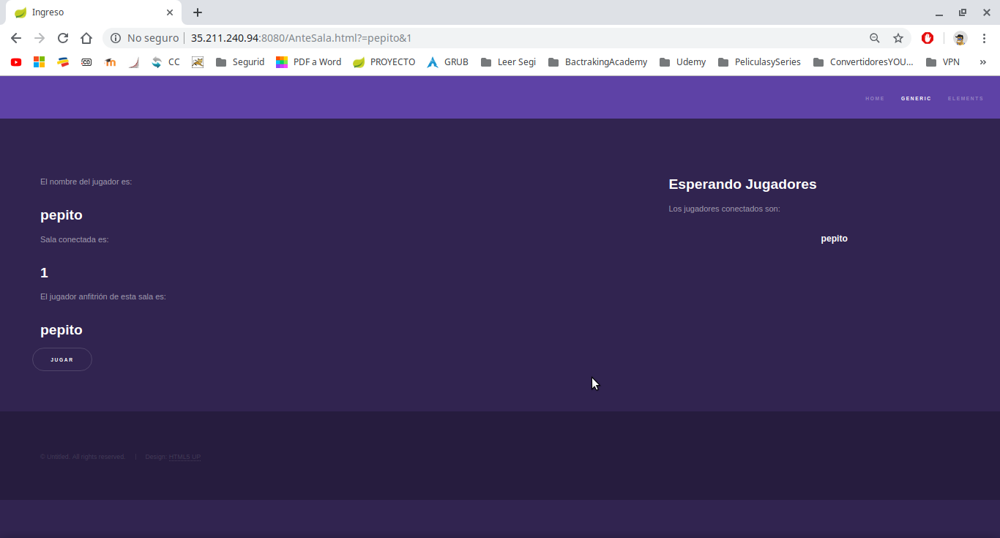

---

- Despues los jugadores pueden ver sus resultador de manera ordenada.

---

- Los jugadores o cualquier usuario podra consultar el historial de los mejores
  puntajes en cartMode de manera ordenada.

---

## Pruebas con Postman

---

## CartModeCOntroller

- Obtener todos los nombres de los jugadores de la aplicacion.

---

- Obtener todos los nombres de los jugadores de una sala.

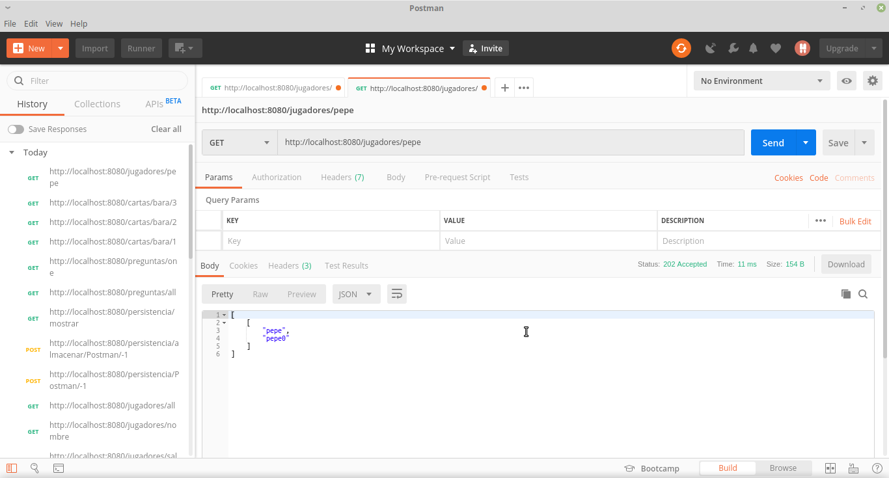

---

- Cantidad de Jugadores en una sala especifica.

---

- Añadiendo un nuevo jugador al juego.

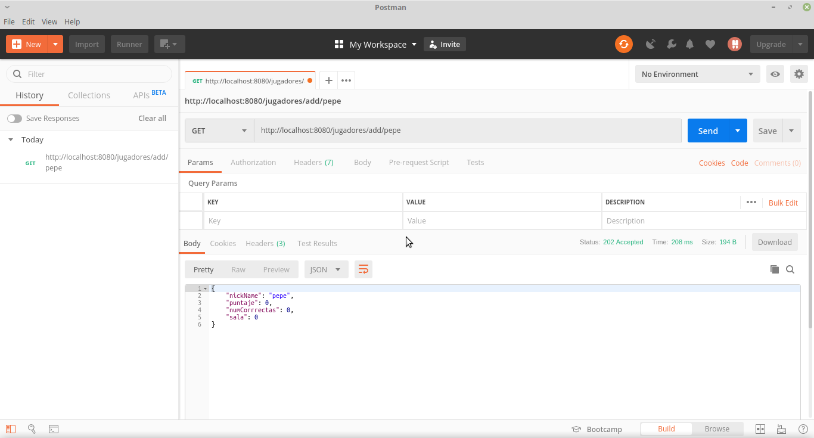

---
- Datos completos sobre todos los jugadores de la aplicacion.

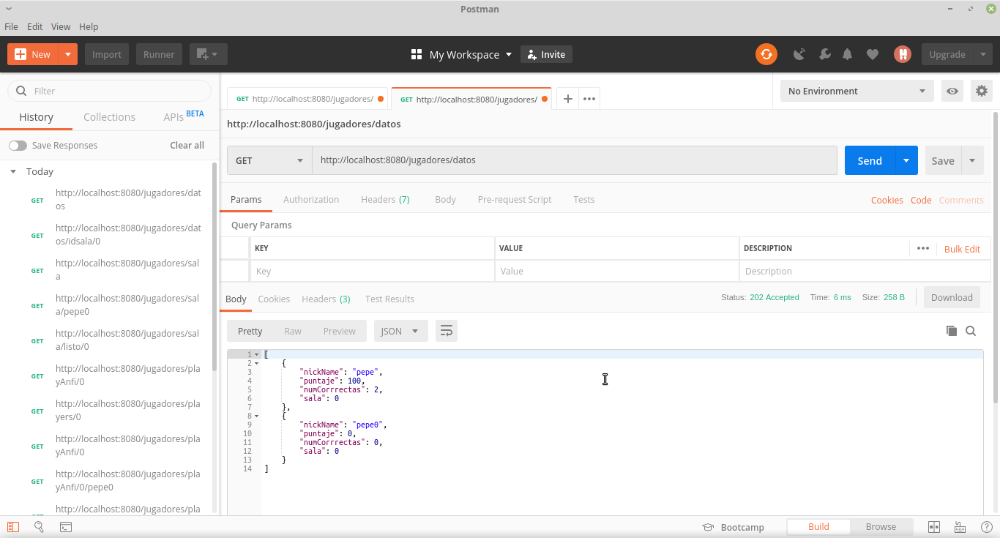

---
- Datos completos sobre todos los jugadores de una sala especifica de 
la aplicacion.

---
- Toda la informacion sobre todas las salas que esten creadas en la aplicacion.

---
- Informacion sobre sala a la cual pertenece un jugador especifico.
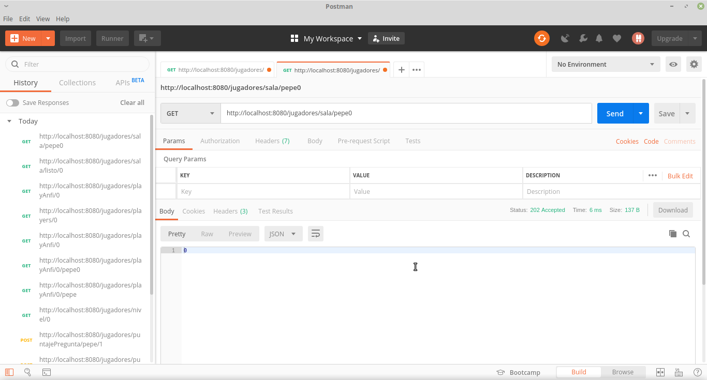

---
- Nos retorna un valor booleano y saber si la sala ya inicio o todavia esta 
en espera.

---
- Retorna todos los nombres de los jugadores de una sala especifica.

---
- Nos regresa el jugador anfitrion de la sala especificada.

---
- Nos regresa un valor booleano informando si el jugador pasado como 
parametro es o no Anfitrion en su sala.
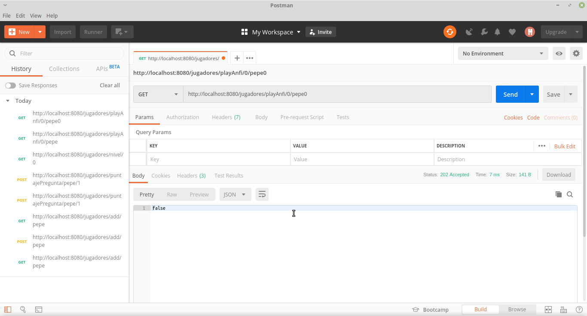

---
- Nos regresa el nivel de la sala especificada.

---
- Adiciona un puntaje cuando el jugador responde correctamente una pregunta.
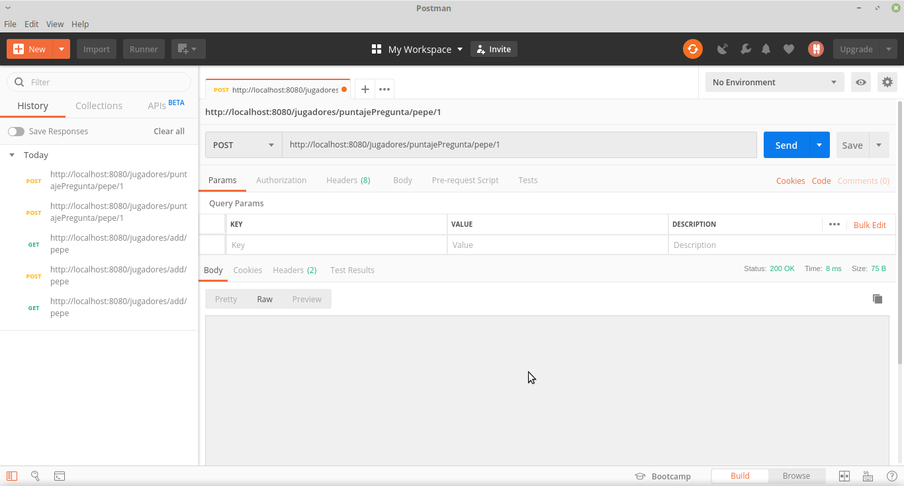

---

## CartMode ControllerPersistence

---
- Adicionar nuevos jugadores a la base de datos.

---
- Muestra a todos los jugadores almacenados en la base de datos.

---

## CartMode Controller Preguntas

---
- Nos muestra todas las preguntas del sistema.

---
- Nos regresa una pregunta aleatoriamente de todas las preguntas del sistema.

---
- Nos regresa una baraja de cartas con una configuracion deacuerdo al nivel 
que se le pase como parametro.

- Nivel 1

- Nivel 2

- NIvel 3
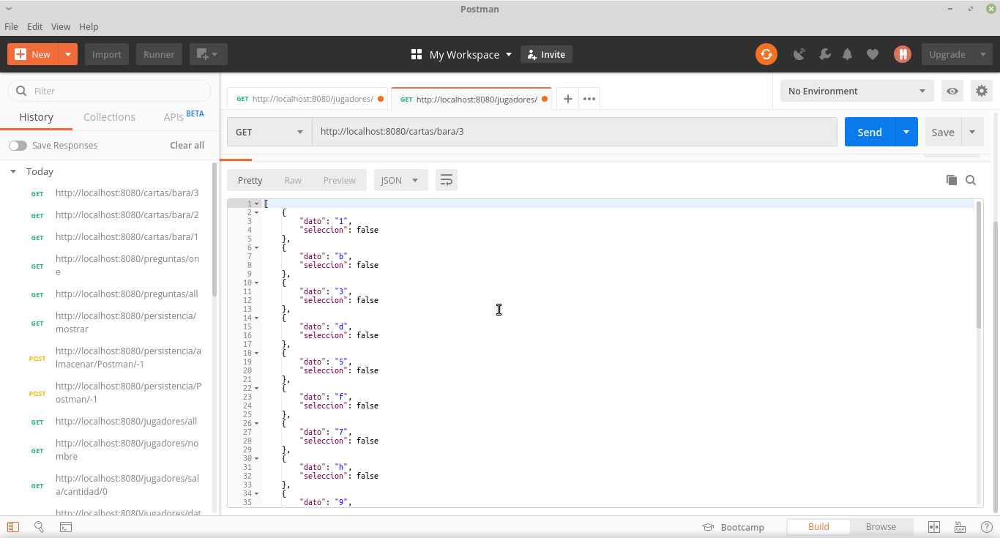

---

### :triangular_ruler: Diseño de arquitectura 
#### - Paquetes

#### - Clases

#### - Paquete Detalle 1

#### - Paquete Detalle 2

#### - Paquete Detalle 3
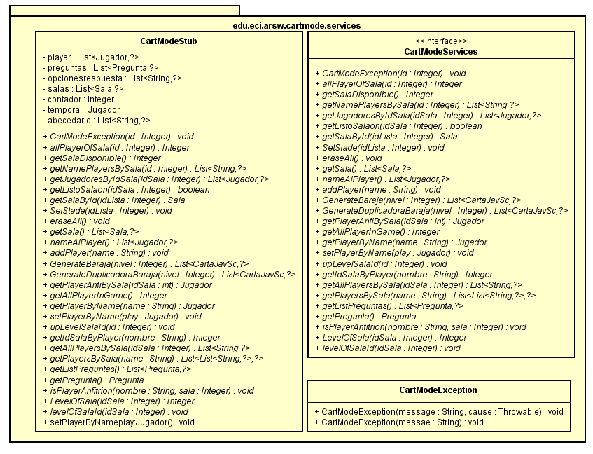
#### - Interaccion Stomp

#### - Diagrama de Despliege
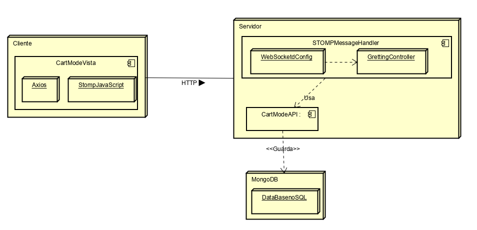

---
### :wrench: Tecnologías utilizadas

---
### Licencia
[MIT]()
